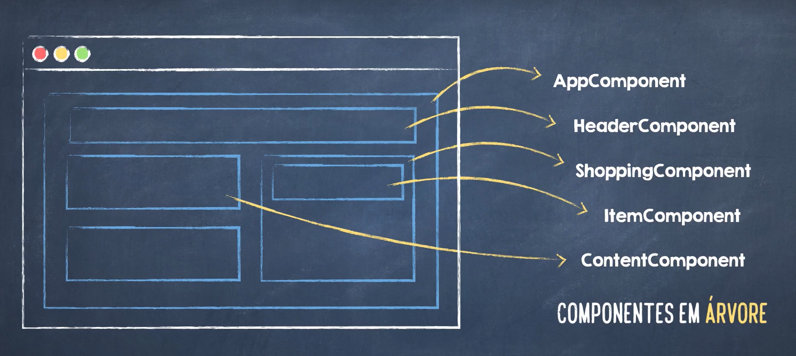
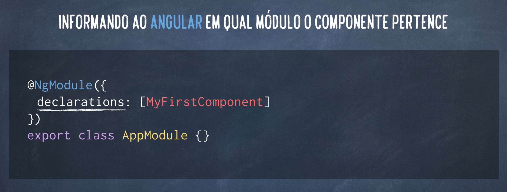

# O que é um Componente
Um Componente são pequenas partes independentes e reuzaveis. Em Angular, são pequenas **classes** que têm um determinado ciclo de vida,
possuem um **template** para definir a aparencia e um **selector** (TAG) para ser usada por outras partes da aplicação.
Componentes são portanto elementos personalizados. No caso do AngularJS (Angular 1), estamos muito acostumados com controllers e scopes,
porém nas novas versões do Angular, uma página vai ser composta por partes menores que podem funcionar de forma independente ou se comunicar entre si
através de **eventos**. 
Na estutura proposta pelo framework, os componentes são dispostos em estrutura de árvore, na raiz, há sempre o **component** **parent** seguido dos seus filhos




## Como definir um componente
A classe de um componente é uma classe que segue a sintaxe do ECMAScript 2015 mais as features do Typescript. Sempre que declaramos a classe à marcamos com a palavra **export** para que ela possa ser referenciada posteriormente em outros arquivos de configurações exigidos pelo framework. Por tanto, quando marcamos com export, esse arquivo passa a ser um **modulo** **ECMAScript** **2015**. Porém existem outras coisas que devemos informar ao Angular, por exemplo, qual o nome da tag que queremos usar com este componente, para isso utilizamos o decorator **@Component**, no decorator, precisamos informar duas coisas obrigatóriamente O **selector** que é a tag, e qual o **template** que o componente vai ter.
Existem duas formas de declararmos um template que pode ser um **arquivo** **externo** através do atributo
**templateUrl**, a url pode ser relativa, absoluta ou uma url HTTP. A segunda forma é declarar o template direto dentro do arquivo mas usando o atributo **template** em vez de **templateUrl**, está segunda forma é recomendada apenas se o nosso template for pequeno e simples, caso contrario sempre prefira usar um arquivo separado. Um template declarado no mesmo arquivo pode ter inumeras linhas usando a sintaxe de **template** **string** do ECMAScript 2015.

```
import { Component } from '@angular/core'

@Component({
    selector: 'app-first',
    templateUrl: './myfirst.component.html'
})

export class MyFirstComponent {
    constructor(){}
}

```

Templates podem ter expressões que resolvem as propriedades do componente, isso é chamado de **Template** **Interpolation**, mas não é só isso, elas também podem acessar propriedades mais complexas de um template usando o **operador** **ponto** (**.**), como no exemplo abaixo, onde a propriedade name da propriedade user é extraida dentro do template.

```
import { Component } from '@angular/core'

@Component({
    selector: 'app-first',
    templateUrl: `<h1>{{title}}</h1>
                  <p>Welcome, {{user.name}}!</p>`
})

export class MyFirstComponent {
    title: string = 'My Star War Component!'
    user = {name: 'Luke Skywalker'}
}

```

## Módulo Angular
Uma vez criado o componente, é necessário informar em qual **Modulo** **Angular** o componente vai estar.
O Modulo Angular é responsavel por saber quais componentes, serviços e diretivas fazem parte da aplicação, cada um desses precisam estar em um módulo. Se a declaração for feita em um modulo raiz, toda a aplicação tem acesso àquele componente.

