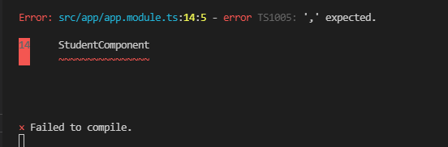
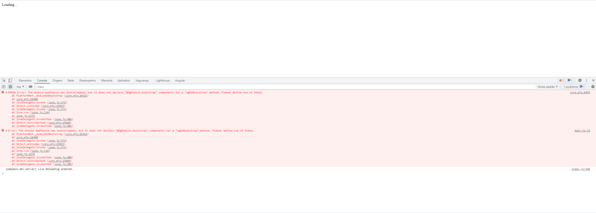

# Aula 31 - Lidando com Erros

A medida que vamos desenvolvendo os nossos componentes podemos estar cometendo alguns erros e esses erros são reportados para nós em dois lugares.

## Erro mostrado via Terminal

Caso a compilação feita pelo **Webpack** falhe, o erro nos será mostrado via terminal.

A imagem acima nos mostra que há um erro no arquivo **app.module.ts** na linha 14, coluna 5. O erro avisa que está faltando uma ",".

Quando Estivermos fazendo várias mudanças, sempre precisamos prestar atenção no terminal durante essas mudanças para identificarmos possiveis erros.

O Terminal é o primeiro lugar que devemos estar observando por problemas de compilação. Se o Webpack não conseguir **compilar** o nosso código ou produzir os **bundles** o terminal será o primeiro lugar que ele vai reportar estes erros.

## Console do Browser

Ao contrário do Terminal que mostra erros de compilação, o **Console do Browser** mostra **erros de execução**. Alguns erros acontecerão somente em **runtime**

A imagem acima mostra que nossa aplicação não foi carregada, ficando "presa" com o texto "Loading...", com isso, notamos um erro de execução em nossa aplicação.

Para avaliarmos o erro, utilizamos o **DevTools** ao pressionar <kbd>F12</kbd> e navergarmos até a aba "**Console**", nesta aba encontraremos uma descrição do nosso problema. Neste caso, o problema é que o módulo **AppModule** foi _startado_ porém não há nada dentro do elemento **bootstrap** nem o método **ngDoBootstrap**. Com isso notamos que é necessário fazer esta declaração.
