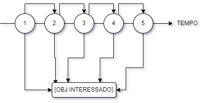

# Reactive Programming e Http

## Reactive Programming

A ideia de programação reativa é simples, um evento acontece e os que estão interessados são notificados e reagem a ele. Sendo mais direto, a ideia é baseada num padrão bem comum da web chamado de **Observer Pattern**, Nesse padrão teremos o objeto que é o foco _interesse_ e vamos ter outros objetos _interessados_ em alguma mudança desse primeiro objeto que são os **listeners**.
Os listeners se inscrevem e esperam uma mudança ou melhor dizendo, um evento. Quando o evento acontece, o listener, que é o interessado, executa uma ação. Essa é a ideia base.
Em **Reactive Programming** os eventos vem em forma _streamings_ ou melhor dizendo, em uma sequencia de eventos que podem ser modificados ou até transformados em uma nova cadeia de eventos. Então, cada evento que acontece gera uma notificação aos objetos interessados.



No exemplo acima, temos 5 objetos de notificação, a streaming vai ser consumida item a item até que chegue no fim e não existam mais objetos. Então cada evento que acontece gera notificação aos objetos interessados.

Reactive Programming é então uma combinação de dois padrões **Iterator**, porque vai de item a item na stream, mais **Observer**, porque notifica os listeners interessados.

Em Angular várias partes do framework são implementados em cima desse conceito, por exemplos, ao realizarmos uma chamada HTTP ao backend, parte da nossa aplicação vai se inscrever e esperar pela resposta que é o evento. Quando o evento acontecer ou seja, quando a resposta chegar, a nossa aplicação irá reagir a ela e extrair os dados necessários para preencher um componente ou informação na tela por exemplo.
Outro exemplo que usa Reactive Programming dentro do Angular é quando desejamos saber quando os parâmetros das rotas mudam. O mesmo padrão nos inscrevemos e esperamos pela resposta.

A biblioteca que o Angular usa para Reactive Programming é o **RXJS** chamada de **React Extensions**. No RXJS o objeto principal é **observable**. No dia a dia talvez não precisaremos criar objetos do tipo _observable_ porque na maioria dos casos a aplicação vai estar ouvindo eventos produzidos pelo Angular.

### **Observable**

O Observable possui uma série de funções ou operadores para inscrição e manipulação de eventos mas existe uma similáridade com funções de outro tipo bem conhecido que é o array.

#### Exemplos

```
// Usando Array

[1, 2, 3, 4, 5]
    .map( x => x + 3)
    .filter(x => x % 2 == 0)
    .forEach(x => console.log(x)) // 4, 6, 8
```

```
// Usando Observable

Observable.from([1, 2, 3, 4, 5])   --------------| STREAM
    .map( x => x + 3)              --------------| TRANSFORMAÇÃO
    .filter(x => x % 2 == 0)
    .subscribe(x => console.log(x)) // 4, 6, 8 --------------| LISTENER
```

No exemplo acima, temos métodos comuns a ambos, o **Map** serve para transformar os itens, **Filter** serve para filtrar os itens e o **subscribe** é muito similar ao **forEach** pois cada item do array será passado para a função do argumento do método do subscribe.

Uma das grandes diferenças entre **Observables (Multiplos Eventos)** e **Promises (Um Evento)** é que Observables continuam disparando eventos até que sejam explicitamente fechados, já Promises são consideradas resolvidas depois do primeiro evento.
Isso dá um pouco mais de flexibilidade a Observables como por exemplo a capacidade de usar **Web Sockets**.

#### Exemplos 2

```
this.http.get('/url)
    .map( response => response.json() )
    .subscribe( data => this.mydata = data )
```

Se formos olhar esse exemplo da API HTTP do Angular, vamos observar que os métodos retornam **observable**, um dos objetos principais do RXJS, e na maioria dos casos vamos transformar a resposta e colher o dado. A requisição é feita sempre depois que a aplicação se inscreve usando o método **subscribe**.

RXJS permite coisas bem interessantes como facilmente refazer chamadas HTTP com o método **.retry()**

```
this.http.get('/url)
    .retry(2)
    .map( response => response.json() )
    .subscribe( data => this.mydata = data )
```

ou ainda fazer multiplos mapeamentos até que a resposta seja da forma que esperamos quando o objeto, como no exemplo abaixo.

```
this.http.get('/url, JSON.stringify( myData ))
    .map( response => response.json() )
    .map( result => result.id )
    .subscribe( id => this.id = id )
```

## Subscribe / Unsubscribe

Quando um objeto se inscreve em um observable, será necessário remover a inscrição posterior para evitar **Memory Leaks**, mesmo que um componente saia de cena ou seja, a página mude e o componente é descartado, o Listener que foi inscrito pode continuar sendo chamando. Então nesses casos é importante realizar o cancelamento da inscrição. Mas o Angular traz algo positivo, os observables retornados pela API HTTP ou pelos parametros de Router e pelo _pipe_ **ASYNC** não precisam de cancelamento de inscrição (Unsubscribe). Então quem geralmente vai acessar a API HTTP do Angular são os serviços da aplicação, sendo assim, é uma boa pratica realizar um tratamento de erro básico dessa camada usando o operador **CATCH**. Depois de um erro, o observable vai parar de enviar eventos.

#### Exemplo **Catch**

O método **catch** recebe o objeto de um erro e tem que devolver um outro observable, no exemplo abaixo, um observable que propaga um erro para cima.

```
save (myData) {
    return this.http.post('/url', JSON.stringfy( myData ))
        .map( response => response.json() )
        .map( result => result.id )
        .catch( error => {
            console.log(error)
            Observable.throw(`Error posting ${myData}`)
        })
}
```
